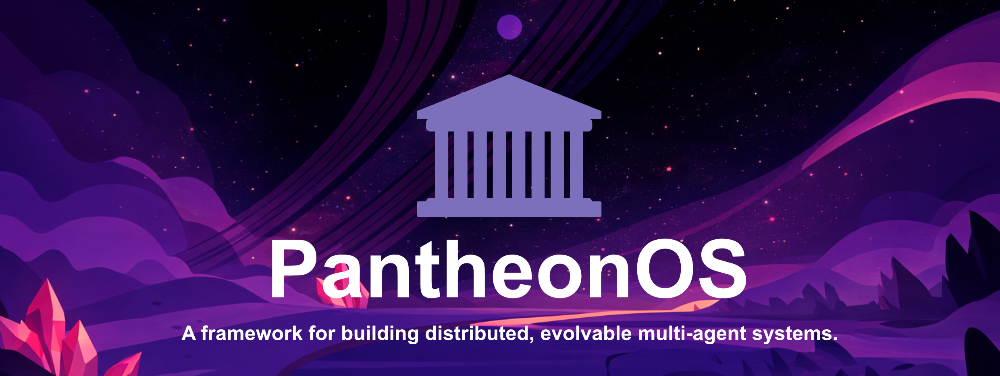

<div align="center">



[Official Site][official-site] · [Online App][online-app] · [Documents][docs] · [Feedback][github-issues-link]

[official-site]: https://pantheonos.stanford.edu/
[online-app]: https://app.pantheonos.stanford.edu/
[docs]: https://pantheonos.readthedocs.io/en/latest/

</div>

<div align="center">

<!-- SHIELD GROUP -->

[![][website-shield]][website-link]
[![][online-app-shield]][online-app]
[![][manuscript-shield]][manuscript-link]<br/>
[![][slack-shield]][slack-link]
[![][discord-shield]][discord-link]
[![][x-shield]][x-link]
[![][bluesky-shield]][bluesky-link]<br/>
[![][github-contributors-shield]][github-contributors-link]
[![][github-forks-shield]][github-forks-link]
[![][github-stars-shield]][github-stars-link]
[![][github-issues-shield]][github-issues-link]
[![][github-license-shield]][github-license-link]<br/>
[![][pypi-shield]][pypi-link]
[![][python-shield]][python-link]
[![][status-shield]]()

</div>

## `1` [What is PantheonOS?](#1-what-is-pantheonos)

PantheonOS is an **evolvable, privacy-preserving multi-agent framework** designed to reconcile generality with domain specificity. Autonomous agents powered by large language models collaborate to conduct biological discovery — achieving super-human performance on specialized scientific tasks.

### Key Highlights

- **Distributed Architecture** — NATS-based messaging for scalable, fault-tolerant deployments across machines
- **Evolvable** — Pantheon-Evolve module enables agents to improve algorithms and code through genetic-algorithm-driven agentic code evolution
- **Multi-Agent Teams** — PantheonTeam, Sequential, Swarm, Mixture-of-Agents (MoA), and AgentAsTool team patterns for flexible orchestration
- **Friendly Interfaces** — Interactive CLI (`pantheon cli`) and Chatroom UI (`pantheon ui`)

## `2` [Quick Start & Community](#2-quick-start--community)

| | |
| :--- | :--- |
| [![][pypi-shield]][pypi-link] | `pip install pantheon-agents` |
| [![][slack-shield-badge]][slack-link] | Join our Slack community! |
| [![][discord-shield-badge]][discord-link] | Join our Discord community! |

## `3` [Installation](#3-installation)

### Using uv (Recommended)

[uv](https://github.com/astral-sh/uv) is a fast Python package manager that handles dependencies efficiently.

```bash
# Install uv (if not already installed)
# macOS/Linux
curl -LsSf https://astral.sh/uv/install.sh | sh
# Windows
powershell -c "irm https://astral.sh/uv/install.ps1 | iex"

# Clone and install
git clone https://github.com/aristoteleo/PantheonOS.git
cd PantheonOS
uv sync

# With optional dependencies
uv sync --extra knowledge  # RAG/vector search support
uv sync --extra slack      # Slack integration
uv sync --extra r          # R language support (requires R installed)
```

### Using pip

```bash
# Basic installation
pip install pantheon-agents

# With optional dependencies
pip install "pantheon-agents[knowledge]"  # RAG/vector search support
pip install "pantheon-agents[slack]"      # Slack integration
```

### Development Installation

```bash
git clone https://github.com/aristoteleo/PantheonOS.git
cd PantheonOS
uv sync --extra dev --extra knowledge

# Run tests
uv run pytest tests/
```

## `4` [Usage](#4-usage)

### CLI Mode

```bash
# Start the interactive REPL
pantheon cli
```

### Chatroom UI

```bash
# Start the multi-agent chatroom
pantheon ui --auto-start-nats --auto-ui
```

### API Usage

Please refer to our [Documents][docs] for detailed API usage, including creating agents, using toolsets, and building teams.

## `5` [Contributing](#5-contributing)

Contributions of all types are more than welcome! If you are interested in contributing code, feel free to check out our GitHub [Issues][github-issues-link] to dive in.

[![][pr-welcome-shield]][pr-welcome-link]

## License

This project is [BSD 2-Clause](./LICENSE) licensed.

Copyright © 2026 [Qiu Lab](https://www.devo-evo.com/).

<!-- LINK GROUP -->

[github-contributors-link]: https://github.com/aristoteleo/PantheonOS/graphs/contributors
[github-contributors-shield]: https://img.shields.io/github/contributors/aristoteleo/PantheonOS?color=c4f042&labelColor=black&style=flat-square
[github-forks-link]: https://github.com/aristoteleo/PantheonOS/network/members
[github-forks-shield]: https://img.shields.io/github/forks/aristoteleo/PantheonOS?color=8ae8ff&labelColor=black&style=flat-square
[github-issues-link]: https://github.com/aristoteleo/PantheonOS/issues
[github-issues-shield]: https://img.shields.io/github/issues/aristoteleo/PantheonOS?color=ff80eb&labelColor=black&style=flat-square
[github-license-link]: https://github.com/aristoteleo/PantheonOS/blob/main/LICENSE
[github-license-shield]: https://img.shields.io/badge/license-BSD--2--Clause-white?labelColor=black&style=flat-square
[github-stars-link]: https://github.com/aristoteleo/PantheonOS/network/stargazers
[github-stars-shield]: https://img.shields.io/github/stars/aristoteleo/PantheonOS?color=ffcb47&labelColor=black&style=flat-square

[website-link]: https://pantheonos.stanford.edu/
[website-shield]: https://img.shields.io/badge/official--website-55b467?labelColor=black&logo=safari&logoColor=white&style=flat-square
[manuscript-link]: https://pantheonos.stanford.edu/paper
[manuscript-shield]: https://img.shields.io/badge/manuscript-read-red?labelColor=black&logo=arxiv&logoColor=white&style=flat-square
[x-link]: https://x.com/PantheonOS
[x-shield]: https://img.shields.io/badge/X-follow-000000?labelColor=black&logo=x&logoColor=white&style=flat-square
[bluesky-link]: https://bsky.app/profile/pantheonos.bsky.social
[bluesky-shield]: https://img.shields.io/badge/bluesky-follow-0085FF?labelColor=black&logo=bluesky&logoColor=white&style=flat-square
[online-app-shield]: https://img.shields.io/badge/online%20app-try%20now-369eff?labelColor=black&logo=googlechrome&logoColor=white&style=flat-square
[discord-link]: https://discord.com/invite/UHsuzAyz
[discord-shield]: https://img.shields.io/badge/discord-join-5865F2?labelColor=black&logo=discord&logoColor=white&style=flat-square
[discord-shield-badge]: https://img.shields.io/badge/discord-join-5865F2?labelColor=black&logo=discord&logoColor=white&style=flat-square

[slack-link]: https://join.slack.com/t/pantheonos/shared_invite/zt-3bmj318fo-vAWtJA01VkcqyHsleduFjQ
[slack-shield]: https://img.shields.io/badge/slack-join-4A154B?labelColor=black&logo=data:image/svg%2bxml;base64,PHN2ZyB4bWxucz0iaHR0cDovL3d3dy53My5vcmcvMjAwMC9zdmciIHZpZXdCb3g9IjAgMCAyNCAyNCI+PHBhdGggZmlsbD0id2hpdGUiIGQ9Ik01LjA0MiAxNS4xNjVhMi41MjggMi41MjggMCAwIDEtMi41MiAyLjUyM0EyLjUyOCAyLjUyOCAwIDAgMSAwIDE1LjE2NWEyLjUyNyAyLjUyNyAwIDAgMSAyLjUyMi0yLjUyaDIuNTJ2Mi41MnptMS4yNzEgMGEyLjUyNyAyLjUyNyAwIDAgMSAyLjUyMS0yLjUyIDIuNTI3IDIuNTI3IDAgMCAxIDIuNTIxIDIuNTJ2Ni4zMTNBMi41MjggMi41MjggMCAwIDEgOC44MzQgMjRhMi41MjggMi41MjggMCAwIDEtMi41MjEtMi41MjJ2LTYuMzEzek04LjgzNCA1LjA0MmEyLjUyOCAyLjUyOCAwIDAgMS0yLjUyMS0yLjUyQTIuNTI4IDIuNTI4IDAgMCAxIDguODM0IDBhMi41MjggMi41MjggMCAwIDEgMi41MjEgMi41MjJ2Mi41Mkg4LjgzNHptMCAxLjI3MWEyLjUyOCAyLjUyOCAwIDAgMSAyLjUyMSAyLjUyMSAyLjUyOCAyLjUyOCAwIDAgMS0yLjUyMSAyLjUyMUgyLjUyMkEyLjUyOCAyLjUyOCAwIDAgMSAwIDguODM0YTIuNTI4IDIuNTI4IDAgMCAxIDIuNTIyLTIuNTIxaDYuMzEyem0xMC4xMjIgMi41MjFhMi41MjggMi41MjggMCAwIDEgMi41MjItMi41MjFBMi41MjggMi41MjggMCAwIDEgMjQgOC44MzRhMi41MjggMi41MjggMCAwIDEtMi41MjIgMi41MjFoLTIuNTIyVjguODM0em0tMS4yNjggMGEyLjUyOCAyLjUyOCAwIDAgMS0yLjUyMyAyLjUyMSAyLjUyNyAyLjUyNyAwIDAgMS0yLjUyLTIuNTIxVjIuNTIyQTIuNTI3IDIuNTI3IDAgMCAxIDE1LjE2NSAwYTIuNTI4IDIuNTI4IDAgMCAxIDIuNTIzIDIuNTIydjYuMzEyem0tMi41MjMgMTAuMTIyYTIuNTI4IDIuNTI4IDAgMCAxIDIuNTIzIDIuNTIyQTIuNTI4IDIuNTI4IDAgMCAxIDE1LjE2NSAyNGEyLjUyNyAyLjUyNyAwIDAgMS0yLjUyLTIuNTIydi0yLjUyMmgyLjUyem0wLTEuMjY4YTIuNTI3IDIuNTI3IDAgMCAxLTIuNTItMi41MjMgMi41MjcgMi41MjcgMCAwIDEgMi41Mi0yLjUyaDYuMzEzQTIuNTI4IDIuNTI4IDAgMCAxIDI0IDE1LjE2NWEyLjUyOCAyLjUyOCAwIDAgMS0yLjUyMiAyLjUyM2gtNi4zMTN6Ii8+PC9zdmc+&style=flat-square
[slack-shield-badge]: https://img.shields.io/badge/slack-join-4A154B?labelColor=black&logo=data:image/svg%2bxml;base64,PHN2ZyB4bWxucz0iaHR0cDovL3d3dy53My5vcmcvMjAwMC9zdmciIHZpZXdCb3g9IjAgMCAyNCAyNCI+PHBhdGggZmlsbD0id2hpdGUiIGQ9Ik01LjA0MiAxNS4xNjVhMi41MjggMi41MjggMCAwIDEtMi41MiAyLjUyM0EyLjUyOCAyLjUyOCAwIDAgMSAwIDE1LjE2NWEyLjUyNyAyLjUyNyAwIDAgMSAyLjUyMi0yLjUyaDIuNTJ2Mi41MnptMS4yNzEgMGEyLjUyNyAyLjUyNyAwIDAgMSAyLjUyMS0yLjUyIDIuNTI3IDIuNTI3IDAgMCAxIDIuNTIxIDIuNTJ2Ni4zMTNBMi41MjggMi41MjggMCAwIDEgOC44MzQgMjRhMi41MjggMi41MjggMCAwIDEtMi41MjEtMi41MjJ2LTYuMzEzek04LjgzNCA1LjA0MmEyLjUyOCAyLjUyOCAwIDAgMS0yLjUyMS0yLjUyQTIuNTI4IDIuNTI4IDAgMCAxIDguODM0IDBhMi41MjggMi41MjggMCAwIDEgMi41MjEgMi41MjJ2Mi41Mkg4LjgzNHptMCAxLjI3MWEyLjUyOCAyLjUyOCAwIDAgMSAyLjUyMSAyLjUyMSAyLjUyOCAyLjUyOCAwIDAgMS0yLjUyMSAyLjUyMUgyLjUyMkEyLjUyOCAyLjUyOCAwIDAgMSAwIDguODM0YTIuNTI4IDIuNTI4IDAgMCAxIDIuNTIyLTIuNTIxaDYuMzEyem0xMC4xMjIgMi41MjFhMi41MjggMi41MjggMCAwIDEgMi41MjItMi41MjFBMi41MjggMi41MjggMCAwIDEgMjQgOC44MzRhMi41MjggMi41MjggMCAwIDEtMi41MjIgMi41MjFoLTIuNTIyVjguODM0em0tMS4yNjggMGEyLjUyOCAyLjUyOCAwIDAgMS0yLjUyMyAyLjUyMSAyLjUyNyAyLjUyNyAwIDAgMS0yLjUyLTIuNTIxVjIuNTIyQTIuNTI3IDIuNTI3IDAgMCAxIDE1LjE2NSAwYTIuNTI4IDIuNTI4IDAgMCAxIDIuNTIzIDIuNTIydjYuMzEyem0tMi41MjMgMTAuMTIyYTIuNTI4IDIuNTI4IDAgMCAxIDIuNTIzIDIuNTIyQTIuNTI4IDIuNTI4IDAgMCAxIDE1LjE2NSAyNGEyLjUyNyAyLjUyNyAwIDAgMS0yLjUyLTIuNTIydi0yLjUyMmgyLjUyem0wLTEuMjY4YTIuNTI3IDIuNTI3IDAgMCAxLTIuNTItMi41MjMgMi41MjcgMi41MjcgMCAwIDEgMi41Mi0yLjUyaDYuMzEzQTIuNTI4IDIuNTI4IDAgMCAxIDI0IDE1LjE2NWEyLjUyOCAyLjUyOCAwIDAgMS0yLjUyMiAyLjUyM2gtNi4zMTN6Ii8+PC9zdmc+&style=flat-square

[pypi-link]: https://pypi.org/project/pantheon-agents
[pypi-shield]: https://img.shields.io/pypi/v/pantheon-agents?color=369eff&labelColor=black&logo=pypi&logoColor=white&style=flat-square

[python-link]: https://www.python.org/downloads/
[python-shield]: https://img.shields.io/badge/python-3.10%2B-3776AB?labelColor=black&style=flat-square&logo=python&logoColor=white
[status-shield]: https://img.shields.io/badge/status-beta-orange?labelColor=black&style=flat-square


[pr-welcome-link]: https://github.com/aristoteleo/PantheonOS/pulls
[pr-welcome-shield]: https://img.shields.io/badge/👌_pr_welcome-%E2%86%92-ffcb47?labelColor=black&style=for-the-badge
