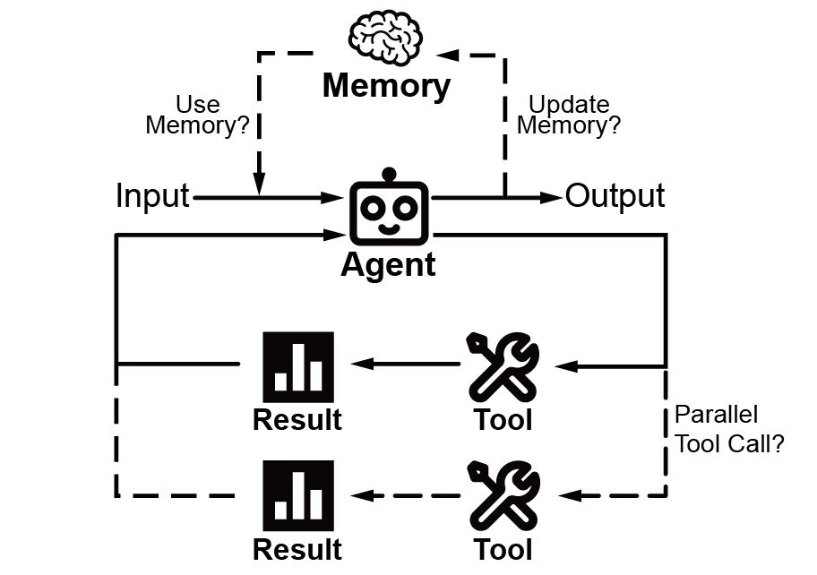

# Core Concepts

This section introduces the core concepts in Pantheon. Understanding these fundamental building blocks will help you effectively use the framework to build sophisticated multi-agent systems.

## Overview

Pantheon is built around several key abstractions that work together to create powerful AI systems:

- **Agents** - AI-powered entities with specific instructions and capabilities
- **Teams** - Collections of agents working together in coordinated patterns
- **Memory** - Systems for persisting information across interactions
- **Toolsets** - Functions and services that extend agent capabilities
- **Providers** - Interfaces for connecting to external tool sources (MCP, remote toolsets)
- **Endpoints** - Network services for distributed deployment
- **ChatRooms** - Interactive interfaces for agent conversations
- **Learning** - Skillbook-based system for agent improvement over time
- **Evolution** - LLM-driven program optimization

---

## Agent

An Agent is the fundamental building block in Pantheon - an AI-powered entity that can understand instructions, use tools, maintain memory, and collaborate with other agents.

### What is an Agent?

An agent in Pantheon is:

- **Autonomous**: Can make decisions and take actions independently
- **Tool-enabled**: Can use various tools to extend its capabilities
- **Stateful**: Maintains context and memory across interactions
- **Collaborative**: Can work with other agents in teams
- **Learnable**: Can improve through the skillbook system



**Essentially, an Agent program is a loop that calls an LLM. In this loop, tool invocation is involved to interact with the external environment, and memory management is involved to save the results into the context.**

#### Instructions
Every agent has instructions that define its behavior and personality. These instructions serve as the agent's core directive, guiding its responses, approach, and interaction style. Well-crafted instructions are crucial for creating agents that behave consistently and effectively.

#### Tools and Capabilities
Agents become powerful through tools - functions that extend their abilities beyond pure conversation. Tools allow agents to interact with external systems, perform calculations, access databases, browse the web, execute code, and much more. The tool system is extensible, allowing you to add custom capabilities tailored to your specific needs.

#### Model Selection
Agents can use any LLM supported by LiteLLM. Model selection can be configured at the agent level or globally through settings. Fallback chains allow graceful degradation when primary models are unavailable.

---

## Team

Teams in Pantheon enable multiple agents to collaborate on complex tasks. Different team structures support various collaboration patterns, from simple sequential processing to sophisticated multi-agent reasoning.

### What is a Team?

A team is a coordinated group of agents that:

- **Collaborate**: Work together towards a common goal
- **Specialize**: Each agent can focus on specific aspects
- **Communicate**: Share information and context
- **Coordinate**: Follow structured interaction patterns

### Team Types

#### PantheonTeam (Recommended)
The default team type with intelligent agent delegation. A lead agent can dynamically delegate tasks to specialist agents using `call_agent()` and discover available agents with `list_agents()`.

**Use Cases:**
- Complex workflows requiring specialized expertise
- Dynamic task routing
- Hierarchical agent organizations

#### Sequential Team
Agents process tasks in a predefined order, with each agent building on the previous one's output. This creates a pipeline where each agent specializes in one stage of a multi-step process.

**Use Cases:**
- Multi-step workflows
- Progressive refinement
- Pipeline processing

#### Swarm Team
Agents can dynamically transfer control to each other based on the task requirements. This creates a flexible system where the conversation flow adapts based on the specific needs of each interaction.

**Use Cases:**
- Dynamic routing
- Specialized handling
- Flexible workflows

#### SwarmCenter Team
A central coordinator agent manages and delegates tasks to worker agents. The coordinator analyzes incoming requests and intelligently distributes work to the most appropriate specialists.

**Use Cases:**
- Task distribution
- Centralized management
- Load balancing

#### Mixture of Agents (MoA) Team
Multiple agents work on the same problem independently, then their outputs are synthesized. This ensemble approach leverages diverse perspectives and reasoning strategies to produce more robust and comprehensive solutions.

**Use Cases:**
- Ensemble reasoning
- Diverse perspectives
- Robust solutions

#### Agent as Tool Team (AaT)
A leader agent treats sub-agents as tools, calling them when specific expertise is needed. This creates a hierarchical structure where the leader orchestrates specialized workers.

**Use Cases:**
- Hierarchical workflows
- Specialized sub-tasks
- Tool-like agent integration

### Team Coordination

#### Message Flow
Teams manage message flow between agents:

```{mermaid}
graph LR
    subgraph "Sequential Flow"
        U1[User] --> A1[Agent1]
        A1 --> A2[Agent2]
        A2 --> A3[Agent3]
        A3 --> R1[Response]
    end
```

```{mermaid}
graph LR
    subgraph "Swarm Flow"
        U2[User] --> A4[Agent1]
        A4 <--> A5[Agent2]
        A5 <--> A6[Agent3]
        A6 --> R2[Response]
    end
```

```{mermaid}
graph LR
    subgraph "MoA Flow"
        U3[User] --> A7[Agent1]
        U3 --> A8[Agent2]
        U3 --> A9[Agent3]
        A7 --> AG[Aggregator]
        A8 --> AG
        A9 --> AG
        AG --> R3[Response]
    end
```

#### Context Sharing
Teams share context between agents to maintain continuity and accumulate knowledge throughout the collaboration. This enables agents to build upon each other's work, share discovered information, and maintain a coherent understanding of the task at hand.

---

## Memory

Memory systems in Pantheon enable agents to maintain context, learn from interactions, and share knowledge. This persistence is crucial for building agents that can handle complex, multi-turn conversations and collaborative tasks.

### What is Memory?

Memory in Pantheon provides:

- **Persistence**: Information survives beyond single interactions
- **Context**: Agents remember previous conversations
- **Learning**: Agents can accumulate knowledge over time
- **Sharing**: Multiple agents can access common information
- **Compression**: Long conversations can be compressed to fit context windows

---

## Toolset

Toolsets extend agent capabilities by providing access to external functions, APIs, and services. They bridge the gap between AI reasoning and real-world actions.

### What is a Toolset?

A toolset is a collection of functions that agents can use to:

- **Execute Code**: Run Python, R, Julia, or shell commands
- **Access Information**: Browse web, query databases
- **Manipulate Files**: Read, write, edit files
- **Integrate Services**: Connect to external APIs
- **Perform Computations**: Complex calculations and analysis
- **Manage Knowledge**: Vector stores and RAG systems

### Built-in Toolsets

#### File Operations
- `FileManagerToolSet` - Read, write, edit, search files with intelligent diffing

#### Code Execution
- `PythonInterpreterToolSet` - Execute Python code
- `ShellToolSet` - Run shell commands
- `IntegratedNotebookToolSet` - Jupyter notebook integration with kernel management

#### Web & Search
- `WebToolSet` - Web browsing and search capabilities
- `ScraperToolSet` - Web scraping with crawl4ai

#### Knowledge & RAG
- `KnowledgeToolSet` - Knowledge base management with LlamaIndex
- `VectorRAGToolSet` - Vector-based retrieval augmented generation

#### Specialized
- `TaskToolSet` - Ephemeral task tracking
- `PackageToolSet` - Package discovery and method extraction
- `EvolutionToolSet` - Program evolution and optimization
- `SkillbookToolSet` - Skill management for agents

### Creating Custom Tools

#### Simple Function Tools
Convert any Python function into a tool using the `@tool` decorator:

```python
from pantheon import ToolSet, tool

class MyTools(ToolSet):
    @tool
    def my_function(self, param: str) -> str:
        """Description for the LLM to understand when to use this tool."""
        return f"Result: {param}"
```

#### Async Tools
Support for asynchronous operations:

```python
@tool
async def fetch_data(self, url: str) -> str:
    """Fetch data from a URL."""
    async with aiohttp.ClientSession() as session:
        async with session.get(url) as response:
            return await response.text()
```

---

## Provider

Providers are interfaces for connecting agents to external tool sources. They abstract the complexity of different tool backends.

### What is a Provider?

A provider enables:

- **Tool Discovery**: Automatic discovery of available tools
- **Remote Execution**: Running tools on remote machines
- **Protocol Support**: Different communication protocols (MCP, NATS, HTTP)
- **Tool Filtering**: Selective exposure of tool subsets

### Provider Types

#### MCPProvider
Connect to Model Context Protocol (MCP) servers:

```python
from pantheon.providers import MCPProvider

# STDIO-based MCP server
mcp = MCPProvider("npx -y @anthropic/mcp-server-filesystem")

# With tool filtering
mcp = MCPProvider("...", filter_prefix="fs_")
```

#### LocalProvider
Use local ToolSet instances:

```python
from pantheon.providers import LocalProvider
from pantheon.toolsets import FileManagerToolSet

provider = LocalProvider(FileManagerToolSet("files"))
```

#### ToolSetProvider
Connect to remote Pantheon toolsets via NATS:

```python
from pantheon.providers import ToolSetProvider

provider = ToolSetProvider(service_id="remote-toolset-id")
```

---

## Endpoint

Endpoints in Pantheon enable distributed deployment of agents and toolsets by exposing them as network services.

### What is an Endpoint?

An endpoint is a network-accessible service that:

- **Exposes Functionality**: Makes agents or tools available over the network
- **Manages Toolsets**: Coordinates multiple tool providers
- **Handles MCP**: Manages MCP server lifecycle
- **Provides Workspace**: File transfer and workspace management

### Deployment Patterns

#### Local Endpoint
Run everything in a single process:

```python
from pantheon.endpoint import Endpoint

endpoint = Endpoint(workspace_dir="./workspace")
```

#### Distributed Deployment
Deploy components across machines:

```python
# On toolset server
toolset = PythonInterpreterToolSet("python")
await toolset.serve()  # Exposes via NATS

# On agent server
agent = Agent(...)
await agent.remote_toolset("service-id")
```

---

## ChatRoom

ChatRoom is an interactive service that provides a user-friendly interface for conversations with agents and teams.

### What is a ChatRoom?

A ChatRoom is a service layer that:

- **Hosts Conversations**: Manages interactive sessions with agents
- **Provides Interface**: Offers web UI and API access
- **Manages State**: Maintains conversation history and context
- **Handles Concurrency**: Supports multiple simultaneous users
- **Enables Persistence**: Saves and restores chat sessions

### Core Features

#### Session Management
ChatRooms manage user sessions automatically, handling multiple concurrent conversations while maintaining isolation between users.

#### Web UI Integration
Connect to Pantheon's web interface at https://pantheon-ui.vercel.app/ for a rich, interactive chat experience.

---

## REPL

The REPL (Read-Eval-Print Loop) provides an interactive command-line interface for working with agents and teams.

### What is the REPL?

The REPL is a feature-rich CLI that provides:

- **Interactive Chat**: Converse with agents in real-time
- **Syntax Highlighting**: Code and markdown rendering
- **File Viewer**: Full-screen file viewing with `/view` command
- **Approval Workflows**: Interactive approval dialogs for agent actions
- **Command System**: Extensible slash commands
- **History**: Persistent command history across sessions

### Key Commands

- `/help` - Show available commands
- `/view <file>` - Full-screen file viewer with syntax highlighting
- `/clear` - Clear conversation context
- `/compress` - Compress conversation history
- `/exit` - Exit the REPL

---

## Learning & Skillbook

The learning system enables agents to improve over time by extracting and applying skills from successful interactions.

### What is a Skillbook?

A skillbook is a persistent store of learned behaviors:

- **Skill Extraction**: Automatic extraction of successful patterns
- **Success Tracking**: Track helpful vs. harmful skill applications
- **Skill Injection**: Inject relevant skills into agent prompts
- **Contradiction Resolution**: Handle conflicting skills

### Learning Pipeline

1. **Execution**: Agent performs tasks
2. **Reflection**: Reflector analyzes execution patterns
3. **Extraction**: Skills are extracted from successful patterns
4. **Validation**: Skills are validated against existing knowledge
5. **Storage**: Valid skills are stored in the skillbook
6. **Application**: Skills are injected into future prompts

---

## Evolution

The evolution system enables LLM-driven program optimization and improvement.

### What is Evolution?

Evolution in Pantheon provides:

- **Program Improvement**: Iteratively improve code through LLM feedback
- **Hybrid Evaluation**: Combine function-based and LLM-based evaluation
- **Version Tracking**: Track program versions and changes
- **Parallel Evaluation**: Evaluate multiple candidates concurrently

### Use Cases

- Prompt optimization
- Code refactoring
- Algorithm improvement
- Configuration tuning

---

## Configuration

Pantheon uses a layered configuration system for flexibility.

### Configuration Layers

1. **User Global**: `~/.pantheon/` - User-wide settings
2. **Project**: `./.pantheon/` - Project-specific settings
3. **Defaults**: Built-in package defaults

### Configuration Files

- `settings.json` - General settings (models, timeouts, etc.)
- `mcp.json` - MCP server configurations
- `agents/*.md` - Agent templates
- `teams/*.md` - Team templates

### Model Selection

Configure default models and fallback chains:

```json
{
  "default_model": "gpt-4o",
  "fallback_models": ["gpt-4o-mini", "claude-3-sonnet"],
  "model_overrides": {
    "reasoning": "o1-preview"
  }
}
```
