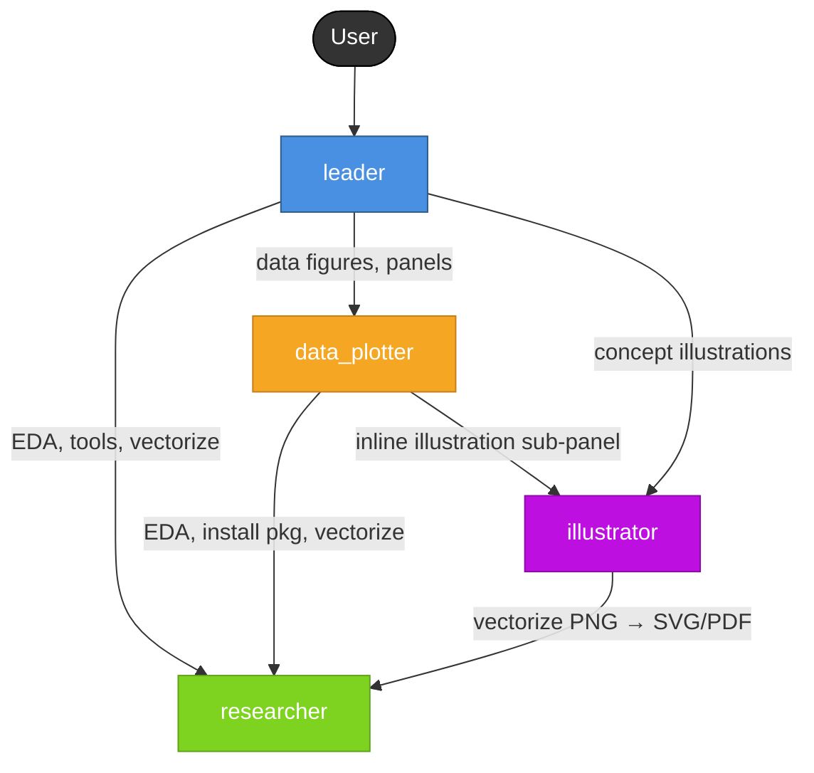

# Graph Maker Team

A specialized AI team for autonomous scientific figure production. Delivers publication-ready figures in three formats per figure (PNG for preview, PDF vector for LaTeX embed, SVG vector for Illustrator/Inkscape editing). Covers data-driven plotting, BioRender-style conceptual illustrations, and composite multi-panel figures.

## Team Structure

| Agent | Role | Key Capabilities |
|-------|------|------------------|
| **leader** | Orchestrator | Intent triage, style card authoring, quality control |
| **researcher** | Generalist support | Data EDA, format detection, journal style lookup, package installation, PNG→SVG/PDF vectorization |
| **data_plotter** | Plot producer | Jupyter-based matplotlib/seaborn/plotly figures with internal observe→critic→revise loop, multi-panel composition (gridspec / svgutils), three-format export |
| **illustrator** | Illustration producer | Methodology / concept / pathway diagrams via a four-phase PaperBanana pipeline (Plan → Style → Render → Critic, T ≤ 3 rounds) using `generate_image` |

## Deliverables

For every finalized figure:
- `{workdir}/outputs/figures/<name>.png` (300–600 DPI raster preview)
- `{workdir}/outputs/figures/<name>.pdf` (vector, LaTeX-embed ready)
- `{workdir}/outputs/figures/<name>.svg` (vector, editable in Illustrator/Inkscape)

Plus:
- `{workdir}/outputs/figure_legends.md` — caption + legend per figure
- `{workdir}/outputs/figure_manifest.json` — machine-readable index

## Supported Intents

| Intent | Pipeline |
|---|---|
| **data-only** | `data_plotter` only |
| **illustration-only** | `illustrator` (four-phase) → `researcher` vectorizes PNG → three-format export |
| **composite-panel** | Both sub-agents in parallel → `data_plotter` composes with svgutils |

## Style Governance

Every task begins with a canonical `{workdir}/inputs/style_card.json` — the single source of truth for DPI, colors, fonts, and figure dimensions. Sub-agents MUST read and apply the style card; leader enforces consistency across figures.

The `aesthetic_guide` field in `style_card.json` names a style file distributed via the **`figure_styling` skill** (`skills/figure_styling/styles/<aesthetic_guide>.md`). Sub-agents load that file on demand — it is NOT inlined into their system prompts. Built-in style files:

| aesthetic_guide | Target | Figure class |
|---|---|---|
| `neurips_diagram` | NeurIPS / top ML venues | Methodology / framework / pipeline diagrams |
| `neurips_plot` | NeurIPS / top ML venues | Statistical plots |
| `custom` / `null` | — | Rely only on `style_card.json` + agent defaults |

Users can extend with additional files (e.g., `nature_figure.md`, `ieee_figure.md`) and reference them by id in `style_card.json`. Conflict priority: **user references > style_card.json > figure_styling/<aesthetic_guide> > agent defaults**.

## Workdir Layout

```
{workdir}/
  environment.md              # plotting dependency audit
  inputs/
    data/
    brief.md                  # figure intent, audience, journal
    style_card.json           # canonical style spec
  drafts/
    notebooks/                # data_plotter notebooks
    illustrations/            # illustrator raw PNGs
    panels/                   # single-panel intermediates
  outputs/
    figures/
      Fig1_main.{png,pdf,svg}
      Fig2_pathway.{png,pdf,svg}
      ...
    figure_legends.md
    figure_manifest.json
```

## Core Workflow

1. **Triage**: Classify intent (data / illustration / composite); detect target (journal / slides / web); write `inputs/brief.md`.
2. **Style card**: Author `inputs/style_card.json` with DPI, fonts, colors, figure sizes.
3. **Environment audit**: `researcher` checks matplotlib/seaborn/plotly/svgutils/Pillow/inkscape.
4. **Data EDA** (data-only or composite): `researcher` writes `drafts/eda_summary.md` and recommends plot types.
5. **Figure production** (parallelized across independent figures):
   - Data panels → `data_plotter` with style card injection
   - Conceptual panels → `scientific_illustrator` → PNG, then `researcher` vectorizes to SVG/PDF
6. **Composition** (composite intent): `data_plotter` composes via svgutils and exports triplet.
7. **Verification**: leader runs `file` + `observe_images` on each figure; re-delegates on failure.
8. **Manifest + legends**: leader writes `outputs/figure_manifest.json` and finalizes `figure_legends.md`.
9. **Delivery**: concise summary of figure paths returned to user.

## Agent Call Relationships

```
                              [User]
                                │
                                ▼
                          ┌───────────┐
                          │   leader  │
                          └───────────┘
                    ┌──────────┼──────────────────┐
                    │          │                  │
                    ▼          ▼                  ▼
              ┌──────────┐ ┌──────────────┐ ┌──────────────┐
              │researcher│ │ data_plotter │ │ illustrator  │
              └──────────┘ └──────────────┘ └──────────────┘
                   ▲              │                    │
                   │              │                    │
                   │              ▼                    ▼
                   └────── (data_plotter/illustrator → researcher for tools, vectorization)
                                  │                    │
                                  └────── (data_plotter → illustrator for inline illustrations)
```



## Call Relationship Summary

| Caller | Can Call | Purpose |
|--------|----------|---------|
| **leader** | `researcher`, `data_plotter`, `illustrator` | Orchestrate end-to-end |
| **data_plotter** | `researcher`, `illustrator` | EDA/tools/vectorize; request inline illustration sub-panels |
| **illustrator** | `researcher` | Vectorize produced PNG; install tools |
| **researcher** | _(none)_ | Leaf node — provides services |

---

## End-to-End Interaction Flow (Data Contracts & File Formats)

This section documents the complete workflow, intermediate data files, and
their schemas. It is the single source of truth for how the four agents
exchange information. The leader agent SHOULD treat the schemas below as
binding contracts.

### Workdir Layout Overview

```
{workdir}/
├── environment.md                       # Step 5 env audit
├── triage.md                            # Step 1 classification (optional)
├── inputs/
│   ├── data/                            # user data files (copy or symlink)
│   ├── brief.json                       # Step 3 core contract
│   ├── style_card.json                  # Step 4 visual contract
│   └── references/                      # Step 2 output (may be absent)
│       ├── local/                       # Stage A downloaded/extracted refs
│       │   ├── user_fig_copy.png
│       │   ├── paper_page3.png
│       │   └── ...
│       └── normalized.json              # Stage A + B output
├── drafts/
│   ├── eda_summary.md                   # Step 6 output
│   ├── notebooks/                       # data_plotter intermediates
│   │   ├── <name>.ipynb
│   │   ├── <name>_round0.png            # low-DPI preview
│   │   ├── <name>_round0.json           # critic JSON
│   │   ├── <name>_round1.png
│   │   ├── <name>_round1.json
│   │   └── <name>_trace.json            # round log
│   ├── illustrations/                   # illustrator intermediates
│   │   ├── <id>_references.md           # Phase 0 (optional)
│   │   ├── <id>_plan.md                 # Phase 1
│   │   ├── <id>_style.md                # Phase 2
│   │   ├── <id>_round0.png              # Phase 3
│   │   ├── <id>_round0.json             # Phase 4
│   │   ├── <id>_round1.png
│   │   ├── <id>_round1.json
│   │   ├── <id>_final.png
│   │   └── <id>_trace.json
│   └── panels/                          # composite-panel intermediates
└── outputs/
    ├── figures/                         # final triplet deliverables
    │   ├── Fig1_main.png
    │   ├── Fig1_main.pdf
    │   ├── Fig1_main.svg
    │   └── ...
    ├── figure_legends.md
    └── figure_manifest.json             # machine-readable index
```

### Flow Overview (Leader Orchestration)

```
User Message
     │
     ▼
┌──────────────────────────────────────────────────────────┐
│ Step 1  TRIAGE (leader internal reasoning)               │
│   Classify intent ∈ {data-only, illustration-only,       │
│                      composite-panel}                    │
│   Infer category, aspect_ratio, target, journal,         │
│   audience. Do NOT write brief.json yet.                 │
└──────────────────────────────────────────────────────────┘
     │
     ▼
┌──────────────────────────────────────────────────────────┐
│ Step 2  REFERENCE DETECTION (leader internal scan)       │
│   Scan user message → strong_hits + keyword_hits         │
│   has_references = boolean                               │
│                                                          │
│   if has_references:                                     │
│       → Stage A (researcher): normalize heterogeneous    │
│         material (images, PDFs, URLs, directories)       │
│       → Stage B (researcher, conditional): Top-K pick    │
│       produces: inputs/references/normalized.json        │
│   else:                                                  │
│       skip retrieval → rely on aesthetic guide loaded    │
│       from `figure_styling` skill                        │
└──────────────────────────────────────────────────────────┘
     │
     ▼
┌──────────────────────────────────────────────────────────┐
│ Step 3  WRITE brief.json                                 │
│   Freeze Step 1 + Step 2 into a structured contract.     │
│   → inputs/brief.json                                    │
└──────────────────────────────────────────────────────────┘
     │
     ▼
┌──────────────────────────────────────────────────────────┐
│ Step 4  WRITE style_card.json                            │
│   Auto-pick aesthetic_guide ∈ {neurips_diagram,          │
│     neurips_plot, custom, null}                          │
│   Sub-agents load the matching file from the             │
│     `figure_styling` skill:                              │
│     skills/figure_styling/styles/<aesthetic_guide>.md    │
│   If has_references → notes records refs-override-guide  │
│   → inputs/style_card.json                               │
└──────────────────────────────────────────────────────────┘
     │
     ▼
┌─────────────────────────┐   ┌────────────────────────────┐
│ Step 5  ENV AUDIT       │   │ Step 6  DATA EDA           │
│ (researcher)            │——→│ (researcher, parallel)     │
│ Check matplotlib /      │   │ Condition: intent has data │
│ inkscape / monolith /   │   │ → drafts/eda_summary.md    │
│ svgutils / Pillow       │   │                            │
│ → environment.md        │   │                            │
└─────────────────────────┘   └────────────────────────────┘
     │
     ▼
┌──────────────────────────────────────────────────────────┐
│ Step 7  FIGURE PRODUCTION (parallel per figure)          │
│                                                          │
│   data_plotter  (statistical_plot)                       │
│   illustrator   (diagram / illustration)                 │
│                                                          │
│   Each sub-agent runs its own internal iteration         │
│   (T ≤ 2–3 rounds).                                       │
└──────────────────────────────────────────────────────────┘
     │
     ▼
┌──────────────────────────────────────────────────────────┐
│ Step 7.5  VECTORIZE (illustration-only)                  │
│   (researcher) inkscape/potrace PNG → SVG + PDF          │
│   → outputs/figures/<name>.{svg,pdf}                     │
└──────────────────────────────────────────────────────────┘
     │
     ▼
┌──────────────────────────────────────────────────────────┐
│ Step 8  VERIFICATION (leader)                            │
│   ls + `file` + observe_images per figure.               │
│   Re-delegate with feedback on failure.                  │
└──────────────────────────────────────────────────────────┘
     │
     ▼
┌──────────────────────────────────────────────────────────┐
│ Step 9  MANIFEST & LEGENDS                               │
│   → outputs/figure_manifest.json                         │
│   → outputs/figure_legends.md                            │
└──────────────────────────────────────────────────────────┘
     │
     ▼
Step 10  DELIVERY summary → User
```

### Core Data File Schemas

#### `inputs/brief.json` — the core contract

Generated by leader in Step 3; every sub-agent reads this for task specs.

```json
{
  "intent": "illustration-only",

  "figures": [
    {
      "id": "Fig1",
      "name": "Fig1_framework",
      "category": "agent_reasoning",
      "S_source_context": "Our PaperBanana framework orchestrates five specialized agents: Retriever, Planner, Stylist, Visualizer, and Critic. The Retriever selects top-K references. The Planner produces detailed description P. The Stylist refines into P*. Visualizer and Critic form a T=3 refinement loop.",
      "C_communicative_intent": "Overview of the PaperBanana framework with Linear Planning Phase and Iterative Refinement Loop",
      "aspect_ratio": "1.8:1",
      "notes": "Left-to-right narrative flow. Highlight Critic closed-loop edge."
    }
  ],

  "target": "journal",
  "journal": "neurips",
  "audience": "specialist",

  "references": {
    "has_references": true,
    "trigger_reason": "user message contained arxiv URL plus keyword '模仿'",
    "raw_mentions": [
      {
        "type": "url",
        "value": "https://arxiv.org/abs/2601.23265",
        "context": "模仿这篇论文 Fig 2 的风格"
      },
      {
        "type": "image_path",
        "value": "/Users/me/ref_fig.png",
        "context": "参考 /Users/me/ref_fig.png"
      }
    ],
    "normalized_path": "{workdir}/inputs/references/normalized.json"
  }
}
```

#### `inputs/references/normalized.json` — reference materials normalized

Produced by researcher in Stage A (and optional Stage B).

```json
{
  "entries": [
    {
      "id": "ref_0",
      "source_type": "image",
      "source_path": "/abs/workdir/inputs/references/local/ref_fig_copy.png",
      "source_origin": "/Users/me/ref_fig.png",
      "context": "参考 /Users/me/ref_fig.png",
      "visual_summary": "Left-to-right 3-stage pipeline. Palette: pale lavender #F3E5F5 for zones, deep orange #E67E22 for trainable modules, cool blue #3498DB for frozen. Sans-serif Helvetica bold for labels. Snowflake icons on frozen modules. Rounded rectangles with 8px radius.",
      "category_guess": "agent_reasoning",
      "relevance": "high",
      "status": "ok"
    },
    {
      "id": "ref_1",
      "source_type": "pdf_figure",
      "source_path": "/abs/workdir/inputs/references/local/arxiv_2601_23265_page3.png",
      "source_origin": "https://arxiv.org/abs/2601.23265",
      "context": "模仿这篇论文 Fig 2 的风格",
      "visual_summary": "Two-stage architecture diagram. Cream background #F5F5DC zones. Dashed borders indicate logical groupings. Orthogonal connectors with labeled operators (⊕, ⊗). Serif italicized math variables.",
      "category_guess": "agent_reasoning",
      "relevance": "high",
      "status": "ok"
    }
  ],
  "summary": {
    "total": 2,
    "ok": 2,
    "failed": 0,
    "dominant_category": "agent_reasoning"
  },
  "selected": {
    "selected_ids": ["ref_0", "ref_1"],
    "rationale_per_pick": {
      "ref_0": "Same category (agent_reasoning) and same pipeline structure — direct visual match",
      "ref_1": "Same category, similar architecture diagram with dashed zones — complementary"
    }
  }
}
```

#### `inputs/style_card.json` — visual contract

```json
{
  "target": "journal",
  "journal_class": "neurips",
  "aesthetic_guide": "neurips_diagram",
  "dpi_preview": 300,
  "dpi_final": 600,
  "figure_size_inches": {
    "single_column": [3.5, 2.6],
    "double_column": [7.2, 5.0]
  },
  "font_family": "Helvetica",
  "font_size": {
    "axis_label": 9, "tick": 8, "legend": 8,
    "title": 10, "panel_letter": 11
  },
  "colors": {
    "primary": "#1a365d",
    "secondary": "#2c5282",
    "accent": "#c05621",
    "categorical_palette": ["#1b9e77", "#d95f02", "#7570b3", "#e7298a", "#66a61e"],
    "diverging_cmap": "RdBu_r",
    "sequential_cmap": "viridis"
  },
  "line_width": 1.2,
  "export_formats": ["png", "pdf", "svg"],
  "notes": "User provided references (ref_0, ref_1); their visual style takes priority over the aesthetic guide loaded from the `figure_styling` skill on conflict."
}
```

### Illustrator Internal Data Flow (Phase 0 + four-phase pipeline)

```
brief.json + style_card.json + normalized.json (optional)
                     │
                     ▼
     ┌────────────────────────────────┐
     │ Phase 0 — References Digest    │  (only when has_references=true)
     │   observe_images(each ref)     │
     │   → <id>_references.md         │
     └────────────────────────────────┘
                     │
                     ▼
     ┌────────────────────────────────┐
     │ Phase 1 — Plan (semantic)      │
     │   in: S, C, category,          │
     │       <id>_references.md       │
     │   out: elements + connections  │
     │   → <id>_plan.md  (P)          │
     └────────────────────────────────┘
                     │
                     ▼
     ┌────────────────────────────────┐
     │ Phase 2 — Style (aesthetic)    │
     │   in: P + style_card +         │
     │       figure_styling skill     │
     │       (style file of           │
     │        aesthetic_guide)        │
     │       + references digest      │
     │   priority: refs > guide       │
     │   → <id>_style.md  (P*)        │
     └────────────────────────────────┘
                     │
                     ▼
        ┌────────────────────┐
        │ Phase 3 — Render t │ ←────────┐
        │  generate_image(P) │          │
        │  → <id>_round<t>.png          │
        └────────────────────┘          │
                     │                  │
                     ▼                  │
        ┌────────────────────┐          │
        │ Phase 4 — Critic t │          │
        │  observe_images +  │          │
        │  JSON critique     │          │
        │  → <id>_round<t>.json         │
        └────────────────────┘          │
                     │                  │
                     ▼                  │
           critic.revised_description   │
           == "No changes needed."?     │
                 │                      │
           NO: t<T_max → next round ────┘
           YES or t==T_max: break
                     │
                     ▼
            <id>_final.png + <id>_trace.json
                     │
                     ▼
            (→ researcher vectorizes)
                     │
                     ▼
       outputs/figures/<name>.{png,pdf,svg}
```

#### `drafts/illustrations/<id>_references.md` (Phase 0 output)

```markdown
# References digest for Fig1

### ref_0 — /Users/me/ref_fig.png
- Layout: left-to-right 3-stage pipeline
- Palette: #F3E5F5 (zones), #E67E22 (trainable), #3498DB (frozen)
- Typography: Helvetica bold labels
- Iconography: ❄️ snowflake on frozen modules
- Borders: rounded rectangles, 8px radius
- Takeaway: adopt zones + icon convention + palette

### ref_1 — https://arxiv.org/abs/2601.23265 (Fig 2)
- Layout: two-stage with dashed zones
- Palette: #F5F5DC cream background
- Typography: serif italic for math variables
- Operators: inline ⊕ ⊗ on connectors
- Takeaway: adopt operator placement + cream zone idea

### Consolidated guidance
- Palette: use ref_0 primary (#F3E5F5 zones, #E67E22 trainable, #3498DB frozen)
- Typography: Helvetica bold for labels; serif italic ONLY for math variables
- Borders: rounded rect 8px (ref_0) + dashed for logical grouping (ref_1)
- Icons: ❄️ frozen, 🔥 trainable
- Operators: place ⊕/⊗ inline on connectors (ref_1)
```

#### `drafts/illustrations/<id>_round<t>.json` (Critic output)

```json
{
  "round": 0,
  "faithfulness_issues": [
    "Stylist agent (2nd module) is missing from the render despite being in S"
  ],
  "readability_issues": [
    "Critic → Visualizer feedback arrow is too thin and the dashed style is hard to see"
  ],
  "aesthetics_issues": [
    "Module colors are too saturated vs ref_0's muted palette"
  ],
  "critic_suggestions": "Add the Stylist module between Planner and Visualizer. Strengthen the Critic→Visualizer feedback arrow to 2px dashed. Desaturate module colors to match ref_0 (#E67E22 → #E8A87C).",
  "revised_description": "(Full revised description here — starts from round 0's description, modifies the three identified issues, preserves everything else.)"
}
```

#### `drafts/illustrations/<id>_trace.json`

```json
{
  "id": "Fig1",
  "name": "Fig1_framework",
  "category": "agent_reasoning",
  "aspect_ratio": "1.78:1",
  "rounds_executed": 2,
  "rounds": [
    {"round": 0, "description_file": "Fig1_style.md", "image_file": "Fig1_round0.png", "critique_file": "Fig1_round0.json", "stopped_here": false},
    {"round": 1, "description_file": "Fig1_round0.json#revised_description", "image_file": "Fig1_round1.png", "critique_file": "Fig1_round1.json", "stopped_here": true}
  ],
  "final_image": "Fig1_final.png",
  "stop_reason": "no_changes_needed",
  "references_consulted": ["ref_0", "ref_1"]
}
```

### Data_plotter Internal Data Flow (Pre-round + Critic loop)

```
brief.json + style_card.json + normalized.json (optional)
                     │
                     ▼
   ┌─────────────────────────────────┐
   │ Pre-round: Reference Absorption │  (only when has_references=true)
   │   observe_images(each ref)      │
   │   → extract rcParams-level      │
   │     overrides                   │
   │   priority chain:               │
   │     refs > style_card           │
   │         > figure_styling/       │
   │           neurips_plot > dflt   │
   └─────────────────────────────────┘
                     │
                     ▼
   ┌─────────────────────────────────┐
   │ Notebook Setup Cells            │
   │   Cell 1: imports               │
   │   Cell 2: rcParams (w/ ref ovr) │
   │   Cell 3+: load data + plot     │
   └─────────────────────────────────┘
                     │
                     ▼
        ┌──────────────────────┐
        │ Round 0 Render       │ ←────────┐
        │  run notebook cells  │          │
        │  savefig PNG preview │          │
        │  → <name>_round0.png │          │
        └──────────────────────┘          │
                     │                    │
                     ▼                    │
        ┌──────────────────────┐          │
        │ Round 0 Critic       │          │
        │  observe_images +    │          │
        │  JSON critique       │          │
        │  → <name>_round0.json│          │
        └──────────────────────┘          │
                     │                    │
          revised_code_hints ==           │
          "No changes needed."?           │
                     │                    │
          NO: t<T_max → edit code ────────┘
          YES or t==T_max: break
                     │
                     ▼
      ┌──────────────────────────┐
      │ Final Export Cell        │
      │  savefig PDF + SVG + PNG │
      │  (fonttype=42, dpi=600)  │
      └──────────────────────────┘
                     │
                     ▼
       outputs/figures/<name>.{png,pdf,svg}
                     │
                     ▼
             <name>_trace.json
```

#### `drafts/notebooks/<name>_round<t>.json` (Critic output)

```json
{
  "round": 0,
  "faithfulness_issues": [
    "Category 'baseline' is missing — raw data has 4 categories but plot shows 3"
  ],
  "readability_issues": [
    "x-axis tick labels overlap at 11pt",
    "Legend covers top-right data cluster"
  ],
  "aesthetics_issues": [
    "Top/right spines visible; neurips_plot calls for 'open' look"
  ],
  "style_card_violations": [
    "Axis labels render in Times New Roman; style_card specifies Helvetica"
  ],
  "critic_suggestions": "Add the missing 'baseline' category. Rotate x-tick labels 30° with ha='right'. Move legend to bbox_to_anchor=(1.02, 1). Remove top/right spines.",
  "revised_code_hints": "ax.set_xticklabels(labels, rotation=30, ha='right'); ax.legend(bbox_to_anchor=(1.02,1), loc='upper left'); ax.spines[['top','right']].set_visible(False); add missing 'baseline' row from raw_data.csv"
}
```

### Final Delivery Files

#### `outputs/figure_manifest.json`

```json
{
  "figures": [
    {
      "id": "Fig1",
      "name": "Fig1_framework",
      "intent": "illustration-only",
      "category": "agent_reasoning",
      "source_agent": "illustrator",
      "formats": {
        "png": "/abs/workdir/outputs/figures/Fig1_framework.png",
        "pdf": "/abs/workdir/outputs/figures/Fig1_framework.pdf",
        "svg": "/abs/workdir/outputs/figures/Fig1_framework.svg"
      },
      "dpi": 600,
      "size_inches": [7.2, 4.0],
      "aspect_ratio": "1.80:1",
      "aesthetic_guide": "neurips_diagram",
      "references_used": ["ref_0", "ref_1"],
      "critic_rounds": 2,
      "caption_file": "/abs/workdir/outputs/figure_legends.md#fig1"
    }
  ]
}
```

#### `outputs/figure_legends.md`

```markdown
## Fig1 — Framework overview  <a id="fig1"></a>

**Figure 1.** Overview of the PaperBanana framework. The Linear Planning
Phase (left) consists of Retriever, Planner, and Stylist agents. The
Iterative Refinement Loop (right) couples the Visualizer and Critic
agents across T=3 rounds. Trainable modules (🔥) are shown in orange;
frozen modules (❄️) in blue. Dashed arrows indicate critic feedback.
```

### Three Typical Scenarios

#### Scenario A — No reference material

```
User: "Draw a Transformer architecture diagram"
      │
Step 1: intent=illustration-only, category=generative_learning
Step 2: has_references=false
Step 3: brief.json (references.has_references=false)
Step 4: style_card.aesthetic_guide=neurips_diagram
Step 5–6: env audit
Step 7: illustrator skips Phase 0
         Phase 1: loads figure_styling/styles/neurips_diagram.md via skill
         Phase 2: relies entirely on that aesthetic guide
         Phase 3–4: standard T=2 loop
Step 7.5: researcher vectorizes
Step 8–9: verify + manifest
```

#### Scenario B — User provided an image reference

```
User: "Reference /Users/me/ref.png's style; draw a RAG pipeline"
      │
Step 1: intent=illustration-only, category=agent_reasoning
Step 2: strong_hit (image path) + keyword ("reference") → has_references=true
        Stage A: researcher observe_images(ref.png) → normalized.json (1 entry)
        Stage B skipped (only 1 entry)
Step 3: brief.json.references = { has, raw_mentions, normalized_path }
Step 4: style_card.notes = "user-provided refs take priority"
Step 7: illustrator
         Phase 0: observe ref.png → digest
         Phase 1: borrow layout structure from ref
         Phase 2: ref palette / typography OVERRIDE aesthetic guide defaults
         Phase 3–4: loop
```

#### Scenario C — User provided an arXiv URL + data file

```
User: "Mimic https://arxiv.org/abs/xxx's plot style; draw acc vs params"
      + attached /data/results.csv
      │
Step 1: intent=data-only, category=statistical_plot
Step 2: strong_hit (URL) + keyword ("mimic") → has_references=true
        Stage A: researcher web_crawl + pdftoppm → extract N figures →
                 observe each → normalized.json
        Stage B: if N>5, pick Top-5 by category=statistical_plot
Step 3: brief.json (includes references.normalized_path)
Step 4: style_card.aesthetic_guide=neurips_plot, notes=refs override
Step 6: researcher EDA on /data/results.csv
Step 7: data_plotter
         Pre-round: observe refs → extract rcParams overrides
                    (palette, fonts, spines)
         Cell 2: apply style_card + refs overrides + neurips_plot defaults
         Round 0–2: critic loop
         Final: savefig PDF + SVG + PNG
```

### Priority Chain (used throughout the flow)

```
User message (trigger source)
  > user references (brief.json.references.raw_mentions)
    > normalized.json.entries[].visual_summary
      > style_card.json (explicit overrides)
        > aesthetic_guide file from figure_styling skill
          (styles/neurips_diagram.md / styles/neurips_plot.md / custom)
          > agent built-in defaults
```

Any downstream conflict is resolved along this chain:
**user intent > user material > explicit config > built-in guide > defaults**.
