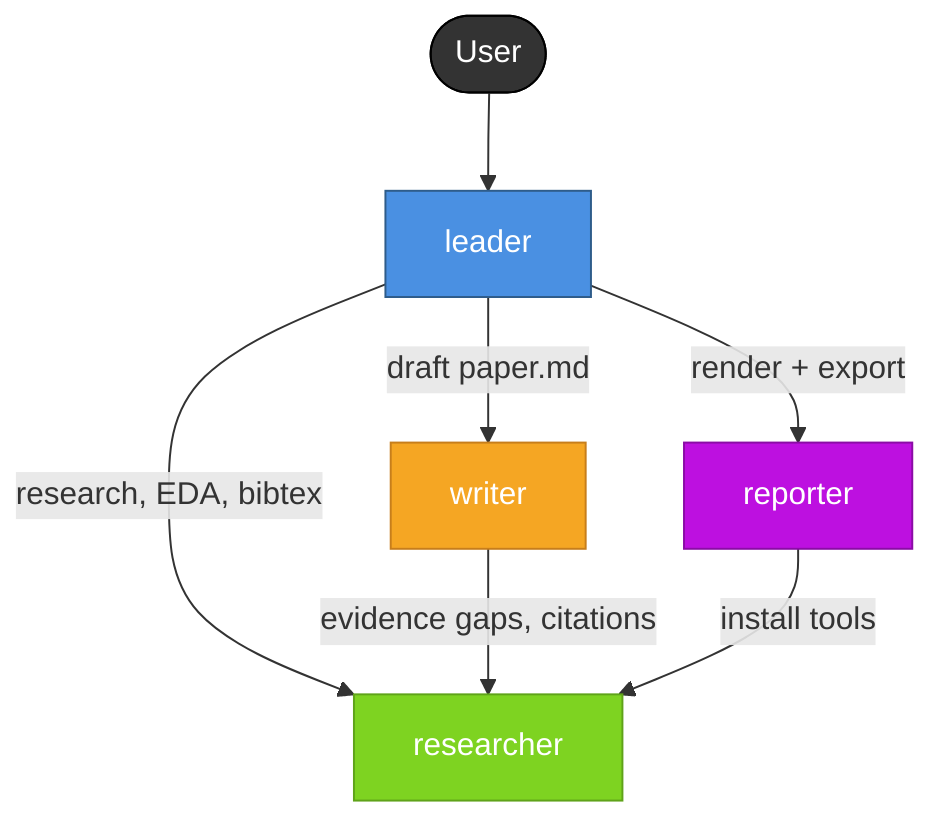

# Paper Write Team

A Markdown-first AI team for autonomous scientific paper writing. The writer produces a single `paper.md` (pandoc academic Markdown) as the source of truth. The reporter converts it to HTML preview (with CSS themes) for UI rendering/editing, and exports to PDF, LaTeX, DOCX, or standalone HTML on demand.

## Architecture

```
draft/paper.md (SSoT — writer produces)
       │
       ├── Frontend Mode A: Markdown editor ←→ paper.md
       │
       ├── Frontend Mode B: Paper format view ←── preview.html (reporter generates)
       │
       └── Export (reporter, on demand):
             ├── PDF quick (HTML → weasyprint)
             ├── PDF submission (Markdown → LaTeX → pdflatex)
             ├── LaTeX source (pandoc)
             ├── DOCX (pandoc)
             └── HTML standalone (monolith)
```

## Team Structure

| Agent | Role | Key Capabilities |
|-------|------|------------------|
| **leader** | Orchestrator | Input triage, mode/theme/export config, writer/reporter scheduling, user feedback routing |
| **researcher** | Generalist support | Literature review, bibtex generation, data EDA, environment audit, package installation |
| **writer** | Scientific author | Produces `paper.md` in pandoc academic Markdown; calls researcher for evidence gaps |
| **reporter** | Conversion engine | pandoc pipeline: Markdown → HTML preview (CSS themes) → PDF/LaTeX/DOCX exports |

## Deliverables

- `report/<slug>_preview.html` — always generated; UI renders this for preview/editing
- `report/<slug>.pdf` — on demand (quick via weasyprint, or submission via LaTeX)
- `report/<slug>.tex` + `.bib` — on demand (for journal submission)
- `report/<slug>.docx` — on demand (for collaborators)
- `report/<slug>_standalone.html` — on demand (offline sharing)

## Supported Modes

- **`bio`** — bioinformatics / biomedical / clinical; IMRaD with Results before Methods; PubMed-preferred citations
- **`generic`** — CS / ML / engineering / physics / chemistry / social science; adaptable structure

## CSS Themes

| Theme | Look |
|---|---|
| `academic_minimal` | White background, navy headings, sans-serif, clean modern |
| `academic_latex` | Mimics LaTeX article class: Computer Modern fonts, paragraph indent, booktabs tables |
| `custom` | User-provided CSS file |

## Supported Input Shapes

| Input | Branch |
|---|---|
| Upstream workdir (e.g., `single_cell_team` output) | Skip literature review → inventory → outline → writer |
| Raw materials (data, drafts, references) | Researcher organizes → literature fill → writer |
| Topic only | Researcher deep literature review → outline → writer |
| Outline + partial materials | Researcher fills gaps → writer expands |

## Work Intensity Levels

| Level | Keyword | Behavior |
|-------|---------|----------|
| Low | "draft", "quick", "初稿" | Skip literature review if materials sufficient; 1 writer pass |
| Medium | (default) | Full workflow |
| High | "deep", "submission", "投稿" | 2 researcher passes; abstract + cover letter; PDF layout verification |

## Workdir Layout

```
{workdir}/
├── triage.md                            # input classification + mode + output config
├── environment.md                       # tool audit
├── materials/                           # user-provided inputs
│   ├── data/
│   ├── figures/
│   ├── drafts/
│   ├── references_seed.bib
│   └── inventory.md
├── research/                            # researcher output
│   ├── literature_review.md
│   ├── references.bib
│   └── gap_analysis.md
├── draft/                               # SSoT layer (writer output)
│   ├── outline.md
│   ├── paper.md                         # THE source of truth
│   └── references.bib                   # merged bibtex
└── report/                              # preview + exports (reporter output)
    ├── <slug>_preview.html              # always generated
    ├── <slug>.pdf                       # on demand
    ├── <slug>.tex                       # on demand
    ├── <slug>.bib                       # on demand
    ├── <slug>.docx                      # on demand
    ├── <slug>_standalone.html           # on demand
    └── DELIVERY.md
```

## Core Workflow

```
User Message
     │
     ▼
┌──────────────────────────────────────────────────────────┐
│ Step 1  TRIAGE (leader)                                  │
│   input_type ∈ {A, B, C, D}                              │
│   mode ∈ {bio, generic}                                  │
│   output_config: html_theme, export_formats, pdf_mode    │
│   work_intensity ∈ {low, medium, high}                   │
│   → triage.md                                            │
└──────────────────────────────────────────────────────────┘
     │
     ▼
┌──────────────────────────────────────────────────────────┐
│ Step 2  ENVIRONMENT AUDIT (researcher)                   │
│   Check: pandoc, pandoc-crossref, weasyprint,            │
│          pdflatex/tectonic, monolith (per export_formats) │
│   Copy CSS theme → themes/active_theme.css               │
│   → environment.md                                       │
└──────────────────────────────────────────────────────────┘
     │
     ▼
┌──────────────────────────────────────────────────────────┐
│ Step 3  MATERIAL INVENTORY (researcher)                  │
│   Condition: input type A, B, or D                       │
│   → materials/inventory.md                               │
└──────────────────────────────────────────────────────────┘
     │
     ▼
┌──────────────────────────────────────────────────────────┐
│ Step 4  LITERATURE REVIEW (researcher)                   │
│   Condition: input type B, C, or D                       │
│   → research/literature_review.md                        │
│   → research/references.bib                              │
│   → research/gap_analysis.md                             │
└──────────────────────────────────────────────────────────┘
     │
     ▼
┌──────────────────────────────────────────────────────────┐
│ Step 5  OUTLINE (writer)                                 │
│   → draft/outline.md                                     │
│   Leader reviews and approves                            │
└──────────────────────────────────────────────────────────┘
     │
     ▼
┌──────────────────────────────────────────────────────────┐
│ Step 6  DRAFTING (writer)                                │
│   Produces single Markdown file with pandoc extensions   │
│   → draft/paper.md  (SSoT)                               │
│   → draft/references.bib  (merged)                       │
│   Writer may call researcher for evidence gaps           │
└──────────────────────────────────────────────────────────┘
     │
     ▼
┌──────────────────────────────────────────────────────────┐
│ Step 7  DRAFT REVIEW (leader)                            │
│   Read paper.md with think + sampled sections            │
│   If issues → writer fixes → re-check                    │
└──────────────────────────────────────────────────────────┘
     │
     ▼
┌──────────────────────────────────────────────────────────┐
│ Step 8  HTML PREVIEW (reporter)                          │
│   pandoc paper.md + CSS theme → preview.html             │
│   → report/<slug>_preview.html                           │
└──────────────────────────────────────────────────────────┘
     │
     ▼
┌──────────────────────────────────────────────────────────┐
│ Step 9  USER REVIEW                                      │
│   User sees preview in UI (Mode A: Markdown / Mode B:    │
│   rendered paper view)                                   │
│                                                          │
│   Feedback via message → writer edits paper.md → Step 8  │
│   Direct edit of paper.md → reporter regenerates → Step 8│
│   User approves → Step 10                                │
└──────────────────────────────────────────────────────────┘
     │
     ▼
┌──────────────────────────────────────────────────────────┐
│ Step 10  EXPORT (reporter, per output_config)            │
│   PDF quick: weasyprint preview.html → .pdf              │
│   PDF submission: pandoc → LaTeX → pdflatex → .pdf       │
│   LaTeX: pandoc → .tex + .bib                            │
│   DOCX: pandoc → .docx                                   │
│   Standalone HTML: monolith → _standalone.html           │
└──────────────────────────────────────────────────────────┘
     │
     ▼
Step 11  DELIVERY → report/DELIVERY.md → User
```

## Agent Call Relationships

```
                              [User]
                                │
                                ▼
                          ┌───────────┐
                          │   leader  │
                          └───────────┘
                    ┌──────────┼──────────┬──────────┐
                    ▼          ▼          ▼          │
              ┌──────────┐ ┌──────┐ ┌──────────┐    │
              │researcher│ │writer│ │ reporter │    │
              └──────────┘ └──────┘ └──────────┘    │
                   ▲          │          │           │
                   │          │          │           │
                   └──────────┘          │           │
                   (writer → researcher  │           │
                    for evidence gaps)   │           │
                                         │           │
                              (reporter → researcher │
                               for tool install)     │
```



## Call Relationship Summary

| Caller | Can Call | Purpose |
|--------|----------|---------|
| **leader** | `researcher`, `writer`, `reporter` | Orchestrate end-to-end |
| **writer** | `researcher` | Fill evidence gaps, generate citations |
| **reporter** | `researcher` | Install missing tools (pandoc, weasyprint, etc.) |
| **researcher** | _(none)_ | Leaf node — provides services |

---

## Agent Responsibility Matrix

```
┌───────────────────────────────────────────────────────────┐
│  Leader (paper_write/leader.md)                           │
│  ─────────────────────────────                            │
│  • Input triage (A/B/C/D input shapes)                    │
│  • Mode detection (bio vs generic)                        │
│  • Output config (html_theme / export_formats / pdf_mode) │
│  • Work intensity judgment (low / medium / high)          │
│  • Schedule researcher / writer / reporter                │
│  • Route user feedback                                    │
└───────────────────────────────────────────────────────────┘

┌───────────────────────────────────────────────────────────┐
│  Researcher (root-level researcher.md, shared)            │
│  ─────────────────────────────                            │
│  • Environment audit (pandoc, weasyprint, pdflatex, etc.) │
│  • Material classification and organization               │
│  • Literature search + bibtex generation                  │
│  • Fill evidence/citation gaps on writer's request        │
│  • Install missing tools on reporter's request            │
└───────────────────────────────────────────────────────────┘

┌───────────────────────────────────────────────────────────┐
│  Writer (paper_write/writer.md)                           │
│  ─────────────────────────────                            │
│  • Produces ONE file: draft/paper.md                      │
│  • Uses pandoc academic Markdown extensions:              │
│      [@cite] / @fig:id / $$math$$ / ::: {.theorem}        │
│  • IMRaD structure (bio / generic variants)               │
│  • Writing order: Methods → Results → Intro → Disc → Abs  │
│  • Calls researcher for evidence gaps                     │
│  • Never writes LaTeX, HTML, or CSS                       │
└───────────────────────────────────────────────────────────┘

┌───────────────────────────────────────────────────────────┐
│  Reporter (paper_write/reporter.md)                       │
│  ─────────────────────────────                            │
│  • pandoc pipeline operator                               │
│  • Reads paper_writing skill for CSS theme content        │
│  • Workflow A: generate HTML preview (always)             │
│  • Workflow B: PDF quick (HTML → weasyprint)              │
│  • Workflow C: PDF submission (MD → LaTeX → pdflatex)     │
│  • Workflow D: LaTeX source export                        │
│  • Workflow E: DOCX export                                │
│  • Workflow F: standalone HTML (monolith)                 │
│  • Workflow G: regenerate after paper.md change           │
│  • Never authors paper content, only converts             │
└───────────────────────────────────────────────────────────┘
```

---

## paper.md Contract (writer's output specification)

Every `paper.md` MUST follow this structure:

```markdown
---
title: "Paper Title"
authors:
  - name: Author Name
    affiliation: Institution
date: 2026-04-22
mode: bio                        # bio | generic
bibliography: references.bib
link-citations: true
---

## Abstract
Text with citation [@key]. 150–250 words.

## Introduction
@smith2024 demonstrated that ... Multiple studies agree
[@a2020; @b2021]. As shown in @fig:overview ...

{#fig:overview}

## Methods
Software X version 1.2 was used ...

## Results

### Subsection
Table @tbl:stats shows ...

| Col A | Col B |
|------:|------:|
|   100 |  0.05 |

: Caption {#tbl:stats}

$$
S = \frac{\log_2(\text{FC})}{-\log_{10}(p)}
$$ {#eq:score}

::: {.theorem}
Formal statement here.
:::

## Discussion
...
```

**Pandoc extensions used:**

- YAML frontmatter (metadata)
- `[@key]` / `@key` (citeproc citations)
- `@fig:id` / `@tbl:id` / `@eq:id` (pandoc-crossref cross-references)
- `$...$` / `$$...$$` (MathJax math)
- `::: {.theorem}` (fenced divs for theorem/lemma/proof environments)
- `[^1]` (footnotes)
- Pipe tables with `: caption {#id}` below
- Figures with `{#fig:id}`

---

## Artifact Matrix

| Artifact | Step | Produced by | Required? | Purpose |
|---|---|---|---|---|
| `triage.md` | 1 | leader | Always | Records triage decision |
| `environment.md` | 2 | researcher | Always | Tool availability |
| `materials/inventory.md` | 3 | researcher | If A/B/D | Material index |
| `research/literature_review.md` | 4 | researcher | If B/C/D | Literature synthesis |
| `research/references.bib` | 4 | researcher | If B/C/D | Auto bibtex |
| `research/gap_analysis.md` | 4 | researcher | If B/C/D | Paper contribution |
| `draft/outline.md` | 5 | writer | Always | Structure skeleton |
| **`draft/paper.md`** | 6 | writer | **Always (SSoT)** | **Single source of truth** |
| `draft/references.bib` | 6 | writer | Always | Merged bibtex |
| **`report/<slug>_preview.html`** | 8 | reporter | **Always** | **UI preview/editing** |
| `report/<slug>.pdf` | 10 | reporter | On demand | Daily share (quick) or submission |
| `report/<slug>.tex` | 10 | reporter | On demand | Journal LaTeX source |
| `report/<slug>.bib` | 10 | reporter | Alongside .tex | LaTeX references |
| `report/<slug>.docx` | 10 | reporter | On demand | Collaborator Word editing |
| `report/<slug>_standalone.html` | 10 | reporter | On demand | Offline sharing |
| `report/DELIVERY.md` | 11 | leader | Always | Final delivery summary |

> **Note**: workdir contains NO `themes/` directory. CSS themes live in
> `.pantheon/skills/paper_writing/themes/` and are read by reporter via the
> skills mechanism. Reporter decides how to apply them (embed in HTML or
> pass via pandoc `--css`).

---

## Two PDF Paths

```
                                 ┌─── Daily share / internal review ──── pdf_mode: quick
                                 │     HTML → weasyprint → PDF
paper.md ─── reporter ───────────┤     (preserves HTML layout fidelity)
                                 │
                                 └─── Journal submission ──────────────── pdf_mode: submission
                                       Markdown → LaTeX → pdflatex → PDF
                                       (LaTeX-grade typographic precision)
```

Leader infers `pdf_mode` from user's natural language:

- "initial draft" / "quick look" → `quick`
- "submission" / "journal" / specific journal name → `submission`

---

## Frontend UI Boundary

Agent system and UI are decoupled. The agent system's contract:

- Produces `draft/paper.md` (SSoT)
- Produces `report/<slug>_preview.html` (for UI rendering)
- Accepts external modifications to `paper.md`, regenerates preview

**The UI layer evolves independently across three tiers:**

```
┌─────────────────────────────────────────────────────────┐
│              Agent System (invariant)                    │
│                                                          │
│  writer → paper.md (SSoT)                                │
│  reporter → preview.html (pandoc from paper.md)          │
│  reporter → exports (PDF/LaTeX/DOCX, from paper.md)      │
│                                                          │
│  Contract: paper.md changes → reporter regenerates all   │
└─────────────────────────────────────────────────────────┘
          ↕  paper.md file read/write
┌─────────────────────────────────────────────────────────┐
│              UI Layer (evolves independently)            │
│                                                          │
│  Tier 1: Message feedback → leader → writer edits .md    │
│  Tier 2: Markdown editor ↔ paper.md direct read/write    │
│  Tier 3: WYSIWYG editor (Milkdown/Tiptap) ↔ paper.md     │
└─────────────────────────────────────────────────────────┘
```

**Agents do not care how the user edits `paper.md`.** They only care
about its current content. This lets the UI evolve without breaking
the agent system.

---

## External Dependency: paper_writing Skill

CSS themes are stored as a standard Pantheon skill, synced automatically
to `.pantheon/skills/paper_writing/`:

```
.pantheon/skills/paper_writing/
├── SKILL.md                         # Theme index + usage guide
└── themes/
    ├── academic_minimal.css         # White bg, navy headings, sans-serif
    └── academic_latex.css           # Mimics LaTeX article class
```

Users can add their own `.css` files here; set `html_theme: custom` in
the output config to use them. Reporter locates and reads these files
via the skills mechanism (no hardcoded paths in prompts).

---

## Full Call Graph (Mermaid)

```mermaid
graph TD
    User([User])
    UI[Frontend UI]

    User -->|message| Leader[leader]
    User <-->|edit paper.md / view HTML| UI
    UI <-->|read/write| PaperMD[(paper.md SSoT)]
    UI <--|render preview| PreviewHTML[(preview.html)]

    Leader -->|EDA, bibtex, env| Researcher[researcher]
    Leader -->|draft| Writer[writer]
    Leader -->|render & export| Reporter[reporter]

    Writer -->|produces| PaperMD
    Writer -->|evidence gaps| Researcher

    Reporter -->|reads| PaperMD
    Reporter -->|reads skill| PaperWritingSkill[(paper_writing skill)]
    Reporter -->|produces| PreviewHTML
    Reporter -->|on-demand| Exports[(PDF/LaTeX/DOCX/standalone)]
    Reporter -->|install tools| Researcher

    style Leader fill:#4A90E2,stroke:#2E5C8A,color:#fff
    style Researcher fill:#7ED321,stroke:#5FA319,color:#fff
    style Writer fill:#F5A623,stroke:#C77E1B,color:#fff
    style Reporter fill:#BD10E0,stroke:#8B0CA6,color:#fff
    style PaperMD fill:#FFE082,stroke:#FF8F00,color:#333
    style PreviewHTML fill:#B2DFDB,stroke:#00695C,color:#333
    style Exports fill:#E1BEE7,stroke:#6A1B9A,color:#333
    style PaperWritingSkill fill:#D1C4E9,stroke:#512DA8,color:#333
```

---

## Key Design Principles

1. **Markdown is SSoT.** `paper.md` is the only authoritative document. All other formats are derived.
2. **Strict responsibility layering.** writer writes, reporter converts, researcher investigates, leader coordinates — no crossing boundaries.
3. **Idempotent regeneration.** `paper.md` changes → re-run pandoc → done. No manual sync needed.
4. **Exports are on demand.** Only generate what the user asked for; never waste compute.
5. **Two PDF paths.** Quick (HTML → weasyprint) for daily use; submission (LaTeX → pdflatex) for journals.
6. **CSS themes control appearance.** Same `paper.md` + different CSS = different look (academic_minimal, academic_latex, or custom).
7. **Skills mechanism for themes.** No new directory convention; CSS lives in `.pantheon/skills/paper_writing/` like any other skill.
8. **UI decoupled.** Agents only read/write `paper.md`; how the user edits it is the UI's concern.

## Priority Chain

```
User's explicit instructions (mode, topic, materials, outline)
  > triage.md decisions (input type, mode, intensity, output_config)
    > researcher outputs (literature, bibtex, inventory)
      > writer output (paper.md)
        > reporter rendering (CSS theme, pandoc options)
```

**User intent > triage decisions > research evidence > draft content > rendering defaults.**
